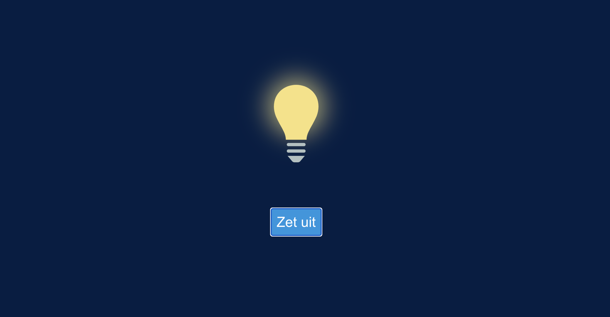

# Opdrachtbeschrijving

## Inleiding

Je gaat ervoor zorgen dat de gebruiker het licht aan- en uit kan zetten doormiddel van een lichtknop die werkt op basis van State. Doormiddel van conditionele styling zal de gebruiker direct kunnen zien wanneer het licht aan of uit staat. Hiervoor maak je gebruik van de React useState-hook.

## Applicatie starten

Als je het project gecloned hebt naar jouw locale machine, installeer je eerst de `node_modules` door het volgende
commando in de terminal te runnen:

`npm install`

Wanneer dit klaar is, kun je de applicatie starten met behulp van:

`npm start`

... of gebruik de WebStorm knop (npm start). Open http://localhost:3000 om de pagina in de browser te bekijken. Begin met
het maken van wijzigingen in `src/App.js`: elke keer als je een bestand opslaat, zullen de wijzigingen te zien zijn op
de webpagina.

## Opdrachtbeschrijving

1. Begin met het creëren van State, om daarin op te slaan of het licht uit (`false`) of aan (`true`) staat. Geef de waarde van de state weer op de pagina zodat je even kunt checken of het initialiseren gelukt is.
2. Zorg ervoor dat wanneer de gebruiker op de knop klikt, de State waarde wordt omgedraaid. Dus: is de waarde `false`? Dan wordt het `true`. Is de waarde `true`? Dan wordt de waarde `false`. Dit doe je door de state-setter methode te gebruiken die je in stap 1 hebt aangemaakt. Tip: test of het ook werkt als je vaker achtereen blijft klikken.
3. Maak de button-tekst nu dynamisch. Wanneer het licht aan staat, geef je de tekst 'Zet uit' weer. Wanneer het licht uit staat, ziet de gebruiker de tekst 'Zet aan'.
4. Maak het af door de styling ook aan te passen op basis van de state. Wanneer het licht aan staat, moet de class `dark` het div-element dat de SVG's omwikkeld staan. Wanneer het licht uit staat, moet de class `light` erop. 